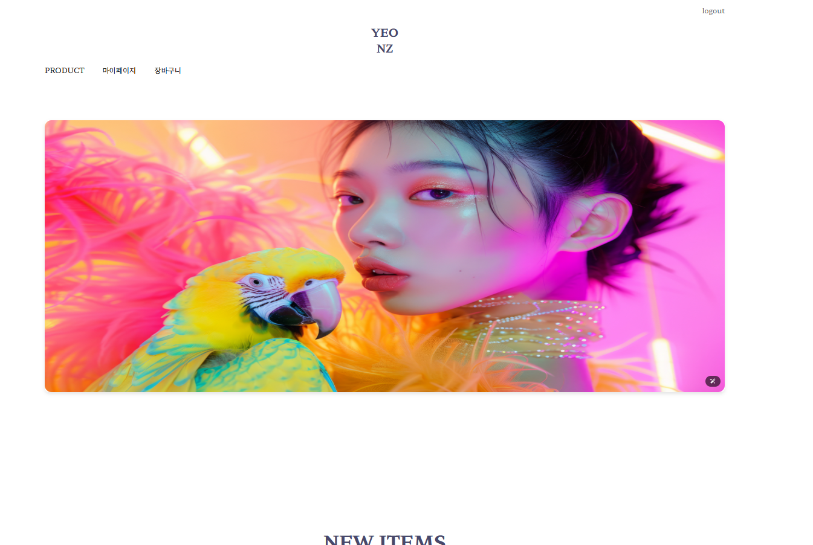
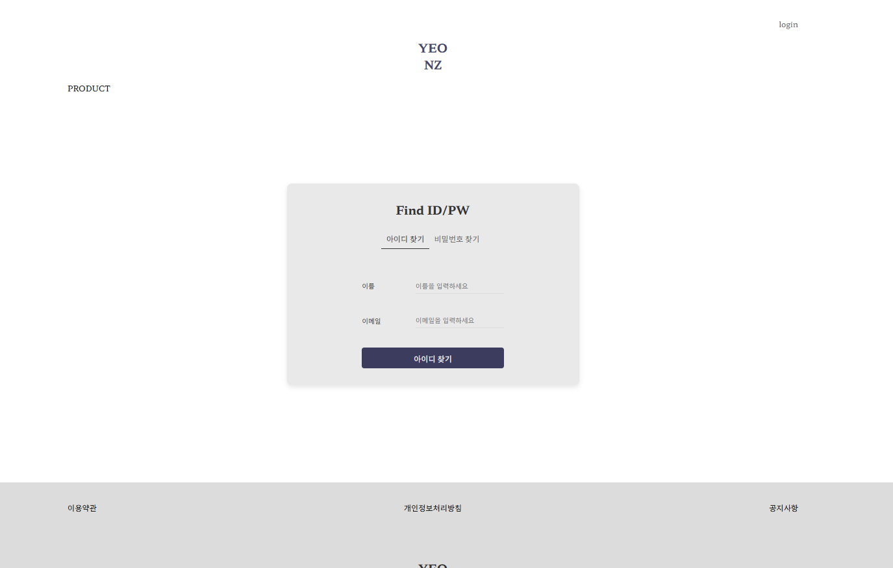
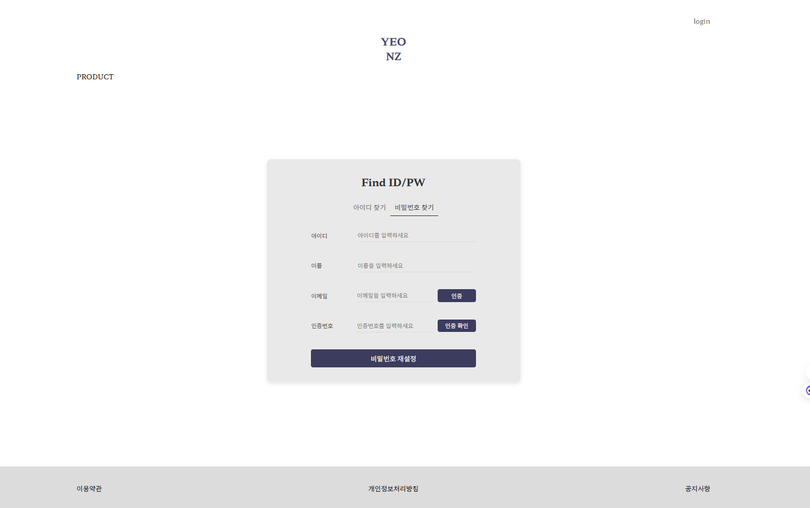
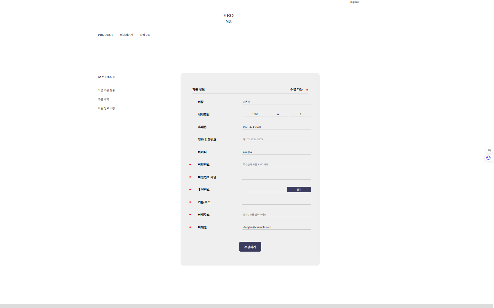

# 🎁 연예인 굿즈 쇼핑몰 (CELEBSTAR GOODS SHOP)

> Spring Boot + JSP 기반의 굿즈 쇼핑몰 프로젝트입니다.  
> 로그인/회원가입/아이디·비밀번호 찾기부터 장바구니 및 주문까지 기능을 구현했습니다.

---

## 🔧 기술 스택

| 분류 | 사용 기술 |
|------|------------|
| 프레임워크 | Spring Boot 3.4.1 |
| 템플릿 | JSP, JSTL |
| 빌드 도구 | Maven |
| 데이터베이스 | MySQL |
| ORM | MyBatis |
| 서버 | Apache Tomcat (내장) |
| 기타 | Lombok, JSTL, Bootstrap 등 |

---

## 💡 주요 기능

### ✅ 회원 기능
- 회원가입
- 아이디 / 비밀번호 찾기
- 회원정보 수정

### 🛒 쇼핑 기능
- 굿즈 리스트 조회
- 장바구니 담기 / 삭제
- 주문서 작성 및 결제

### 🧾 주문 관리
- 주문 내역 확인
- 배송비 포함 총액 계산

---

## 📸 주요 화면

> 아래는 실제 JSP로 구현한 주요 화면 캡처입니다.

### 🔐 로그인 & 회원 기능

| 로그인 | 아이디 찾기 | 비밀번호 찾기 |
|--------|-------------|----------------|
|  |  |  |

| 회원가입 | 회원가입(2) | 회원가입(3) |
|-----------|------------|-------------|
| .png) | .png) | .png) |

| 회원정보 수정 |
|---------------|
|  |

---

## ⚙️ 실행 방법

1. MySQL에 데이터베이스 생성: `semiproject`
2. `application.properties` 또는 `application.yml`에 DB 정보 입력
3. 테이블 생성 (예: users 테이블)
4. `mvn clean install`
5. `localhost:8080` 접속 후 로그인 진행

---

## 📁 프로젝트 구조

```
📦 semiproject
 ┣ 📂 src
 ┃ ┣ 📂 main
 ┃ ┃ ┣ 📂 java
 ┃ ┃ ┃ ┗ 📂 com.project
 ┃ ┃ ┃   ┣ 📂 config               # 스프링 설정 관련
 ┃ ┃ ┃   ┣ 📂 controller           # 컨트롤러 (웹 요청 처리)
 ┃ ┃ ┃   ┣ 📂 mapper               # MyBatis 매퍼 인터페이스
 ┃ ┃ ┃   ┣ 📂 model                # VO/DTO 클래스들
 ┃ ┃ ┃   ┗ 📂 service              # 비즈니스 로직
 ┃ ┃ ┣ 📂 resources
 ┃ ┃ ┃ ┣ 📂 mapper                # MyBatis XML 매퍼
 ┃ ┃ ┃ ┣ 📂 static                # CSS, JS, 이미지 등
 ┃ ┃ ┃ ┣ 📂 templates             # 템플릿 사용 시 (현재 미사용)
 ┃ ┃ ┃ ┗ 📄 application.properties # DB 연결 설정 등
 ┃ ┣ 📂 webapp
 ┃ ┃ ┗ 📂 WEB-INF
 ┃ ┃   ┗ 📂 views
 ┃ ┃     ┣ 📂 kdh_html            # 굿즈 쇼핑몰 관련 JSP 폴더
 ┃ ┃     ┣ 📄 booking.jsp         # 장바구니 페이지
 ┃ ┃     ┣ 📄 krhagreement.jsp    # 이용약관
 ┃ ┃     ┣ 📄 krhfooter.jsp       # 푸터
 ┃ ┃     ┣ 📄 krhheader.jsp       # 헤더
 ┃ ┃     ┣ 📄 krhmain.jsp         # 메인 페이지
 ┃ ┃     ┣ 📄 krhnotice.jsp       # 공지사항
 ┃ ┃     ┣ 📄 krhnoticeview.jsp   # 공지 상세보기
 ┃ ┃     ┣ 📄 krhprivacy.jsp      # 개인정보처리방침
 ┃ ┃     ┗ 📄 krhproduct.jsp      # 상품 상세페이지 등
 ┣ 📂 test
 ┃ ┗ 📂 java                      # 테스트 코드 (현재 비어 있음)
 ┣ 📄 pom.xml                     # Maven 의존성 설정
```

📌 JSP는 `/webapp/WEB-INF/views/` 경로 아래에 위치하며, 직접 URL로 접근할 수 없고 컨트롤러를 통해 forward됩니다.


---

## 🧪 테스트 계정

- 아이디: `testuser`
- 비밀번호: `1234`

---

## 🙋 프로젝트 소개

이 프로젝트는 실전 웹 서비스 제작을 목표로 개발되었으며,  
회원/쇼핑/주문 흐름을 직접 기획하고 구현했습니다.  
초기 설정부터 DB 연동, JSP 렌더링까지 전 과정을 직접 경험할 수 있었습니다.

---

## 📌 기타

- 관리자 기능, 이미지 업로드, 리뷰 작성 등은 추후 확장 예정
- 팀 프로젝트로 구성된 구조를 바탕으로 개별 학습 및 리팩토링

---

## 👨‍💻 개발자

| 이름 | GitHub |
|------|--------|
| 김동하 | [github.com/your-username](https://github.com/your-username) |

---

